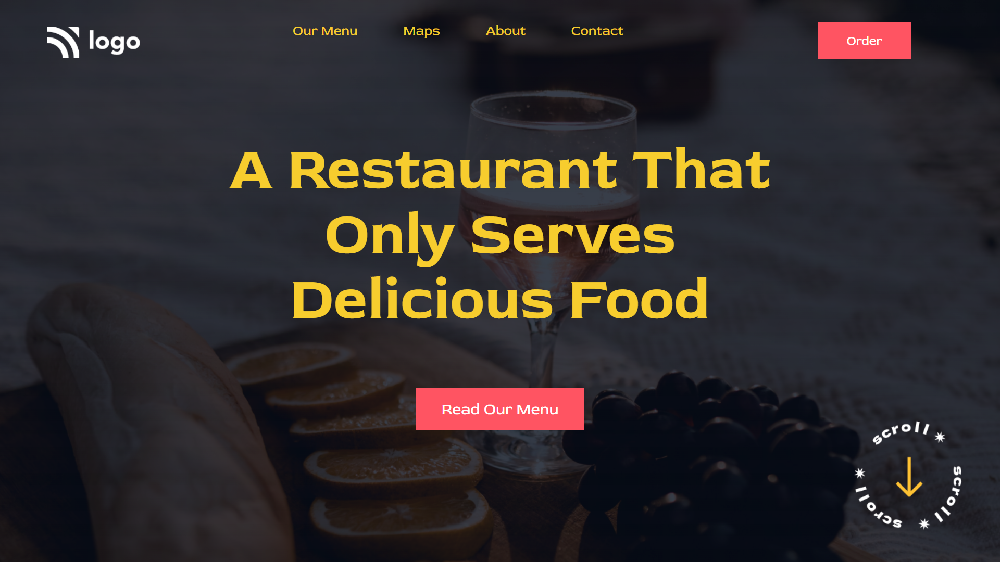

[Live Link](https://food-restaurant-home-page-1.netlify.app/)

## Screenshort

   * * *
  ## What i learned from this project

  - I learned how to use bakcground image in css.
  - I learned to apply gradient over an image
 
 